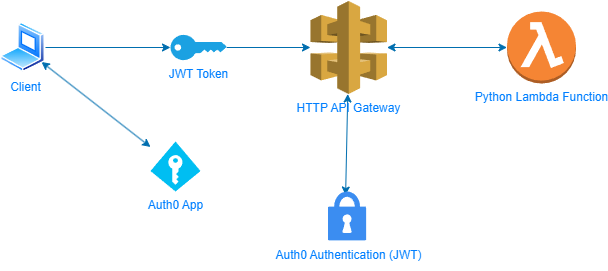

## Introdução

Esse é um lab inspirado em uma job que encontrei no [Upwork](https://www.upwork.com/).

A descrição da tarefa no Upwork: "Estamos construindo um endpoint de API na AWS. Estamos procurando por DevOPs engineer para setar um framework IaC que cria um gateway, implementa autenticação baseada em token, direciona os endpoints para aplicação em Python hospedada na lambda."

## Descrição

O lab consiste em criar uma aplicação lambda com authenticação baseada em tokens JWT através do terraform. Utilizei o [Auth0](https://auth0.com/) como base para autenticação dos tokens.

## Instalação

Criar um arquivo **terraform.tfvars** com as seguintes variáveis:

```config
AWS_ACCESS_KEY     
AWS_SECRET_KEY     
AWS_REGION         
AUTH0_DOMAIN       
AUTH0_CLIENT_ID    
AUTH0_CLIENT_SECRET
```

Mais informações sobre como obter as variáveis no auth0 nesse [link](https://registry.terraform.io/providers/auth0/auth0/latest/docs/guides/quickstart).

Para testar a autenticação:

- Acesse o auth0 > api > Python test API auth (Managed by Terraform) > Test , copie e execute o cURL informado.
- Pegue o access-token retornado e execute o seguinte comando:
  ```bash
  curl -H 'Accept: application/json' -H "Authorization: <access-token>" <api_gateway_stage_url>/
  ```

## Desenho

 